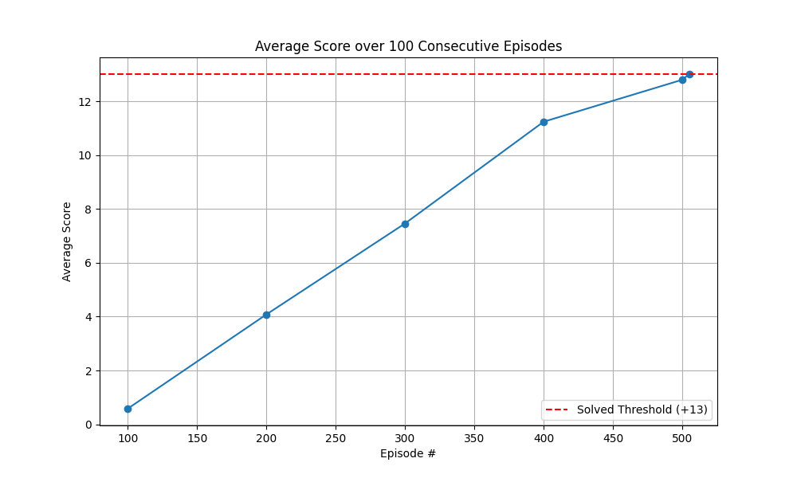

# Project Report

## Learning Algorithm

The agent uses a **Deep Q-Network (DQN)** algorithm to learn the optimal policy. 

### Architecture
- **Input**: Vector observation of size 37.
- **Hidden Layers**: Two fully connected layers with 64 units each and ReLU activation.
- **Output**: 4 discrete actions.

### Hyperparameters
- **Replay Buffer Size**: 100,000
- **Batch Size**: 64
- **Gamma (Discount Factor)**: 0.99
- **Tau (Soft Update)**: 1e-3
- **Learning Rate**: 5e-4
- **Update Frequency**: Every 4 steps

### Double DQN
The agent implements **Double DQN** to reduce overestimation bias. This is controlled by the `USE_DOUBLE_DQN` flag in `src/config.py`.

## Plot of Rewards

The environment was solved in **405 episodes** (Average Score: 13.01).

## Ideas for Future Work

1. **Prioritized Experience Replay**: Replay important transitions more frequently.
2. **Dueling DQN**: Separate streams for state value and advantage.
3. **Rainbow**: Combine multiple improvements (DQN, Double DQN, PER, Dueling, Multi-step, Distributional, Noisy Nets).
